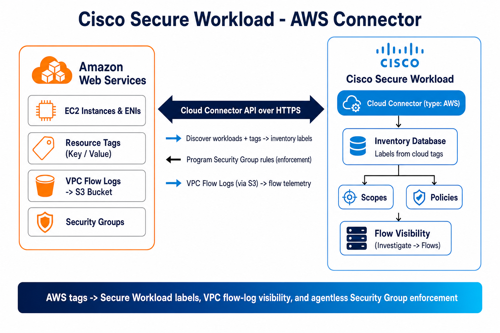

# Cisco Secure Workload — AWS Connector Guide

A step-by-step, **beginner-friendly** integration guide for the **Cisco Secure Workload (CSW) AWS Connector** — covering **EC2 tag & inventory ingestion**, **VPC flow-log visibility**, and **agentless segmentation via native AWS Security Groups**.

> **⚠ Disclaimer:** This is a **community reference guide** prepared by Cisco Solutions Engineering — not an official Cisco product document. Always refer to the [official Cisco Secure Workload documentation](https://www.cisco.com/c/en/us/support/security/tetration/series.html) and the [Compatibility Matrix](https://www.cisco.com/c/m/en_us/products/security/secure-workload-compatibility-matrix.html) for authoritative, up-to-date guidance.

---

## What This Covers

| Area | Detail |
|---|---|
| **Connector** | **AWS Cloud Connector** — **agentless**, requires **no virtual appliance**; CSW talks directly to AWS APIs |
| **Label ingestion** | EC2 instance + ENI **tags** and inventory discovered from your VPCs → imported as `orchestrator_*` labels |
| **Flow visibility** | **VPC Flow Logs** published to an **Amazon S3** bucket are ingested for traffic visibility & policy discovery |
| **Enforcement** | Agentless segmentation by programming **native AWS Security Groups** (allow-list model; automatic SG backup/restore) |
| **Kubernetes** | **Amazon EKS** nodes/pods/services can be discovered (private EKS API needs a **Secure Connector** tunnel) |
| **Transport** | HTTPS/REST to AWS APIs (EC2 for tags/SG, S3 for flow logs); outbound proxy supported |
| **Data direction** | **Bidirectional** — inventory/tags + flow logs **in**; Security Group rules **out** (enforcement) |
| **Verified against** | CSW 4.x SaaS & on-prem; AWS VPC flow logs delivered to Amazon S3 |

---

## Quick Start

### Prerequisites
- An AWS account with the VPCs/EC2 you want to manage
- **VPC Flow Logs** enabled at the VPC level and **published to an Amazon S3 bucket** (CSW cannot read CloudWatch Logs)
- IAM permissions for CSW — the connector wizard generates a **CloudFormation (CFT)** template that provisions the required role/policy
- CSW 4.x with Site Admin / Root Scope Owner rights
- (Enforcement) permission for CSW to manage **Security Groups**
- (Private EKS only) a healthy **Secure Connector** tunnel

### Steps (summary)
1. In CSW: `Manage → Workloads → Connectors → AWS Connector`
2. Choose the capabilities you want: **Managed Inventory** (tags), **Flow Ingestion** (VPC flow logs from S3), **Segmentation** (Security Groups)
3. Download and deploy the generated **CloudFormation template** in your AWS account to create the IAM role/permissions
4. Provide the **S3 bucket** that receives the VPC flow logs
5. Create the connector; the first inventory snapshot populates labels within minutes
6. (Later) enable **Segmentation** to let CSW program Security Groups from your enforced workspace policy

### Verify
1. `Investigate → Inventory Search`
2. Filter on `orchestrator_system/orch_type = AWS`
3. Confirm EC2 tags appear as `orchestrator_*` labels; check `Investigate → Flows` for VPC flow-log traffic

See the [full step-by-step guide](CSW-AWS-Connector-Guide.md) or [open the HTML version](CSW-AWS-Connector-Guide.html).

---

## Architecture Diagram

*The agentless AWS Cloud Connector reaches AWS APIs over HTTPS: it discovers EC2 tags/inventory and ingests VPC flow logs (from S3) into the Secure Workload inventory, and — when enforcement is enabled — programs native AWS Security Groups. No virtual appliance is required.*

---

## Video References

> **Legend:** 🎬 video · 📘 guide · 📄 doc

> There is no single dedicated CSW + AWS Connector video; the resources below cover cloud-connector concepts and the broader segmentation workflow.

| Reference | What it shows |
|---|---|
| [📘 CSW-User-Education library](https://github.com/chandrapati/CSW-User-Education) | Curated CSW learning path incl. cloud onboarding & segmentation concepts |
| [📄 Configure & Manage Connectors (Cisco)](https://www.cisco.com/c/en/us/td/docs/security/workload_security/secure_workload/user-guide/4_0/cisco-secure-workload-user-guide-saas-v40/m-connectors.html) | Official AWS connector configuration reference |

---

## Files in This Repo

| File | Description |
|---|---|
| [`README.md`](README.md) | This file — quick start and overview |
| [`CSW-AWS-Connector-Guide.md`](CSW-AWS-Connector-Guide.md) | Full step-by-step guide (Markdown source) |
| [`CSW-AWS-Connector-Guide.html`](CSW-AWS-Connector-Guide.html) | Styled HTML — open in browser |
| [`csw-aws-architecture.png`](csw-aws-architecture.png) | Architecture diagram |
| [`build.sh`](build.sh) | Regenerate HTML/PDF from Markdown (requires pandoc + Chrome) |

---

## Imported Labels — Quick Reference

Cloud-connector labels are prefixed **`orchestrator_`** (OpenAPI) / shown with `*` in the UI. Your AWS tags are merged in as `orchestrator_<tag-key>`.

| Key | Value |
|---|---|
| `orchestrator_system/orch_type` | `AWS` |
| `orchestrator_system/workload_type` | *(host / service)* |
| `orchestrator_system/machine_name` | *(EC2 instance name)* |
| `orchestrator_system/region` | *(AWS region)* |
| `orchestrator_system/segmentation_enabled` | *(true / false)* |
| `orchestrator_<your-tag-key>` | *(EC2 / ENI tag value, e.g. `orchestrator_Environment`)* |

> **Important:** Cloud connectors require **no virtual appliance**. Enforcement uses an **allow-list** model with a **Catch-All = Deny**; CSW automatically **backs up and can restore** your Security Groups around segmentation changes. Only VPCs whose flow logs are delivered to **S3** are visible to CSW.

---

## Step-by-Step Guides

> **Legend:** 🎬 video · 📘 guide · 📄 doc

Hands-on integration and deployment guides — follow these top to bottom to build out a deployment:

| Guide | Description | Best for |
|-------|-------------|---------|
| [📘 Agent Installation](https://github.com/chandrapati/CSW-Agent-Installation-Guide) | Deploy CSW agents on Linux / Windows / cloud | Day-1 sensor deployment |
| [📘 Policy Lifecycle](https://github.com/chandrapati/CSW-Policy-Lifecycle) | Policy discovery → enforcement workflow | Policy management |
| [📘 ISE / pxGrid](https://github.com/chandrapati/csw-ise-integration) | ISE/pxGrid: user-identity–aware microsegmentation | Identity & Zero Trust |
| [📘 AnyConnect NVM](https://github.com/chandrapati/csw-anyconnect-nvm) | Endpoint process flows + user identity via NVM | Endpoint telemetry |
| [📘 ServiceNow CMDB](https://github.com/chandrapati/csw-servicenow-integration) | ServiceNow CMDB label enrichment for workload scopes | CMDB-driven policy |
| [📘 Infoblox](https://github.com/chandrapati/csw-infoblox-integration) | Infoblox IPAM/DNS extensible-attribute label enrichment | IPAM/DNS-driven policy |
| [📘 F5 BIG-IP](https://github.com/chandrapati/csw-f5-integration) | F5 virtual-server labels, policy enforcement, IPFIX flow visibility | Load balancer segmentation |
| [📘 NetScaler ADC](https://github.com/chandrapati/csw-netscaler-integration) | NetScaler LB virtual-server labels, ACL enforcement + AppFlow/IPFIX flow visibility | Load balancer segmentation |
| [📘 AWS Connector](https://github.com/chandrapati/csw-aws-connector) | EC2 tag ingestion + VPC flow logs + Security Group enforcement | AWS workloads |
| [📘 Azure Connector](https://github.com/chandrapati/csw-azure-connector) | Azure VM tag ingestion + VNet flow logs + NSG enforcement | Azure workloads |
| [📘 GCP Connector](https://github.com/chandrapati/csw-gcp-connector) | GCE label ingestion + VPC flow logs + firewall enforcement | GCP workloads |
| [📘 NetFlow](https://github.com/chandrapati/csw-netflow-integration) | NetFlow v9/IPFIX agentless flow ingestion from switches | Network fabric visibility |
| [📘 ERSPAN](https://github.com/chandrapati/csw-erspan-integration) | Agentless packet mirroring for legacy / OT / IoT devices | Deep agentless visibility |
| [📘 Secure Firewall](https://github.com/chandrapati/CSW-Secure-Firewall-Integration-Guide) | NSEL flow ingestion from Cisco Secure Firewall (FTD/ASA) | Firewall flow visibility |
| [📘 Splunk Integration](https://github.com/chandrapati/csw-splunk-integration) | CSW syslog alerts → Splunk SIEM | SecOps / SIEM teams |

## Resources

> **Legend:** 🎬 video · 📘 guide · 📄 doc

Learning paths, reference material, and day-2 tooling:

| Resource | Description | Best for |
|----------|-------------|---------|
| [📘 User Education](https://github.com/chandrapati/CSW-User-Education) | Onboarding guides, concept explainers, and curated video library | New CSW users |
| [📘 Compliance Mapping](https://github.com/chandrapati/CSW-Compliance-Mapping) | Map CSW controls to NIST, PCI-DSS, HIPAA, CIS | Compliance & audit |
| [📘 Tenant Insights](https://github.com/chandrapati/CSW-Tenant-Insights) | Tenant-level reporting and analytics | Visibility metrics |
| [📘 Operations Toolkit](https://github.com/chandrapati/CSW-Operations-Toolkit) | Day-2 ops scripts: health checks, reporting, policy analysis | Ongoing operations |
| [📄 Supported OS & Compatibility Matrix](https://www.cisco.com/c/m/en_us/products/security/secure-workload-compatibility-matrix.html) | Cisco's authoritative list of supported agent operating systems, external systems, and connector requirements | Platform planning & prerequisites |

> **Suggested customer journey:**
> User Education → Agent Installation → Policy Lifecycle → ISE/pxGrid → ServiceNow CMDB → Infoblox → F5 BIG-IP → NetScaler ADC → Splunk Integration → Compliance Mapping → Operations Toolkit
